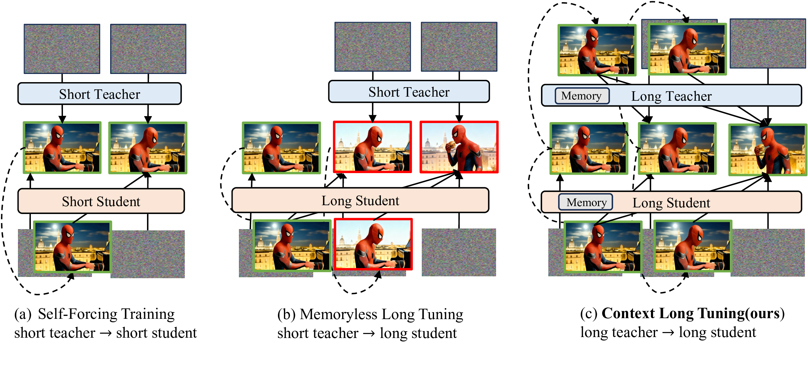
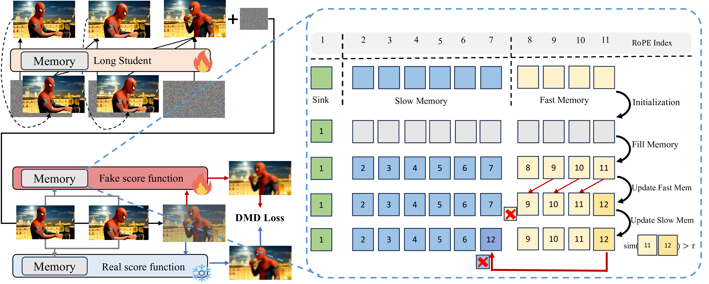

# Context Forcing: Consistent Autoregressive Video Generation with Long Context

[**Paper**](https://arxiv.org/) | [**Project Page**](https://chenshuo20.github.io/Context_Forcing/) 

Official implementation of Context Forcing: Consistent Autoregressive Video Generation with Long Context

[Shuo Chen*](https://chenshuo20.github.io/), [Cong Wei*](https://congwei1230.github.io/), [Sun Sun](https://scholar.google.com/citations?user=2X_jP6kAAAAJ&hl=en), Ping Nie, Kai Zhou, [Ge Zhang](https://scholar.google.com/citations?user=qyTrq4kAAAAJ&hl=zh-CN), [Ming-Hsuan Yang](https://faculty.ucmerced.edu/mhyang/), [Wenhu Chen](https://wenhuchen.github.io/)


Abstract: *Recent approaches to real-time long video generation typically employ streaming tuning strategies, attempting to train a long-context student using a short-context (memoryless) teacher. In these frameworks, the student performs long rollouts but receives supervision from a teacher limited to short 5-second windows. This structural discrepancy creates a critical **student-teacher mismatch**: the teacher's inability to access long-term history prevents it from guiding the student on global temporal dependencies, effectively capping the student's context length.
To resolve this, we propose **Context Forcing**, a novel framework that trains a long-context student via a long-context teacher. By ensuring the teacher is aware of the full generation history, we eliminate the supervision mismatch, enabling the robust training of models capable of long-term consistency. To make this computationally feasible for extreme durations (e.g., 2 minutes), we introduce a context management system that transforms the linearly growing context into a **Slow-Fast Memory** architecture, significantly reducing visual redundancy.
Extensive results demonstrate that our method enables effective context lengths exceeding 20 seconds—$2\text{--}10\times$ longer than state-of-the-art methods like LongLive and Infinite-RoPE. By leveraging this extended context, Context Forcing preserves superior consistency across long durations, surpassing state-of-the-art baselines on various long video evaluation metrics.*

## Training paradigms for AR video diffusion models
<p align="center">
    
</p>
(a) Self-forcing: A student matches a teacher capable of generating only 5s video using a 5s self-rollout. (b) Longlive: The student performs long rollouts supervised by a memoryless 5s teacher on random chunks. The teacher's inability to see beyond its 5s window creates a student-teacher mismatch. (c) Context Forcing (Ours): The student is supervised by a long-context teacher aware of the full generation history, resolving the mismatch in (b).

## Context Forcing and Context Management System
<p align="center">
    
</p>
We use KV Cache as the context memory, and we organize it into three parts: sink, slow memory and fast memory. During contextual DMD training, the long teacher provides supervision to the long student by utilizing the same context memory mechanism.


## Project Updates

- 🔥🔥 News: ```2026/2/5```: Arxiv paper and project page released.

## Todo List
- [] Opensourse inference code and checkpoints. Refactoring the codebase; will be open-sourced shortly.
- [] Opensourse training code.

## Acknowledgement

We would like to thank the following work for their exceptional effort.

- [CausVid](https://github.com/tianweiy/CausVid)
- [Self Forcing](https://github.com/guandeh17/Self-Forcing?tab=readme-ov-file)
- [LongLive](https://github.com/NVlabs/LongLive)
- [Rolling Forcing](https://github.com/TencentARC/RollingForcing)
- [Infinity-RoPE](https://github.com/yesiltepe-hidir/infinity-rope)
- [WorldPlay](https://github.com/Tencent-Hunyuan/HY-WorldPlay)
- [Stable Video Infinity](https://github.com/vita-epfl/Stable-Video-Infinity?tab=readme-ov-file)
- [FramePack](https://github.com/lllyasviel/FramePack)


## Citation

If you find this codebase useful for your research, please kindly cite our paper:

```bibtex

```
