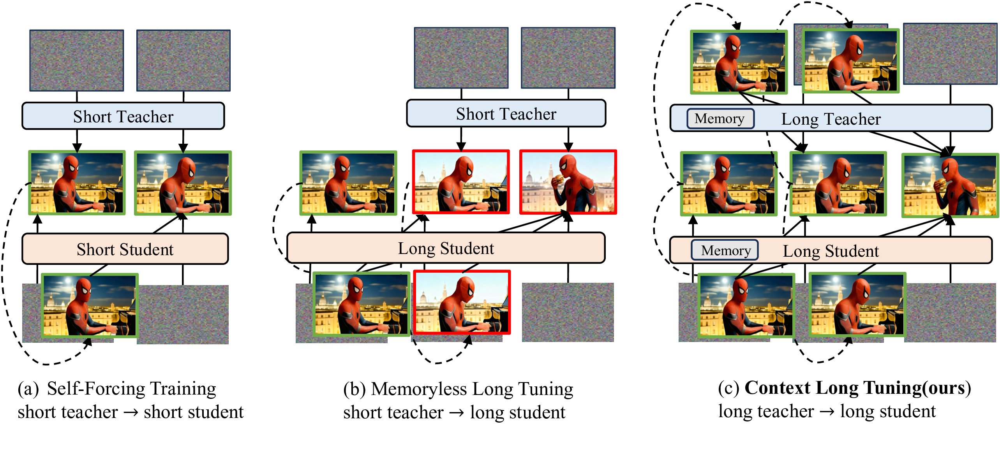
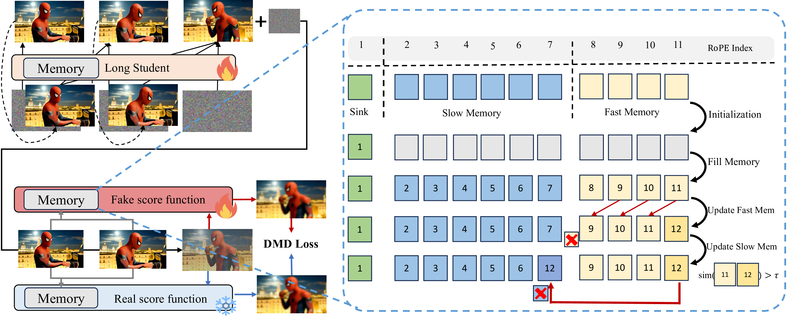

# Context Forcing: Consistent Autoregressive Video Generation with Long Context(ICML2026)

**[Paper](https://arxiv.org/abs/2602.06028)** | **[Project Page](https://chenshuo20.github.io/Context_Forcing/)** 

Official implementation of Context Forcing: Consistent Autoregressive Video Generation with Long Context

[Shuo Chen](https://chenshuo20.github.io/)*, [Cong Wei](https://congwei1230.github.io/)*, [Sun Sun](https://scholar.google.com/citations?user=2X_jP6kAAAAJ&hl=en), [Ping Nie](https://github.com/erenup), Kai Zou, [Ge Zhang](https://scholar.google.com/citations?user=qyTrq4kAAAAJ&hl=zh-CN), [Ming-Hsuan Yang](https://faculty.ucmerced.edu/mhyang/), [Wenhu Chen](https://wenhuchen.github.io/)

Abstract: *Recent approaches to real-time long video generation typically employ streaming tuning strategies, attempting to train a long-context student using a short-context (memoryless) teacher. In these frameworks, the student performs long rollouts but receives supervision from a teacher limited to short 5-second windows. This structural discrepancy creates a critical **student-teacher mismatch**: the teacher's inability to access long-term history prevents it from guiding the student on global temporal dependencies, effectively capping the student's context length.
To resolve this, we propose **Context Forcing**, a novel framework that trains a long-context student via a long-context teacher. By ensuring the teacher is aware of the full generation history, we eliminate the supervision mismatch, enabling the robust training of models capable of long-term consistency. To make this computationally feasible for extreme durations (e.g., 2 minutes), we introduce a context management system that transforms the linearly growing context into a **Slow-Fast Memory** architecture, significantly reducing visual redundancy.
Extensive results demonstrate that our method enables effective context lengths exceeding 20 seconds—$2\text{--}10\times$ longer than state-of-the-art methods like LongLive and Infinite-RoPE. By leveraging this extended context, Context Forcing preserves superior consistency across long durations, surpassing state-of-the-art baselines on various long video evaluation metrics.*

## Training paradigms for AR video diffusion models

<p align="center">
  
</p>

 (a) Self-forcing: A student matches a teacher capable of generating only 5s video using a 5s self-rollout. (b) Longlive: The student performs long rollouts supervised by a memoryless 5s teacher on random chunks. The teacher's inability to see beyond its 5s window creates a student-teacher mismatch. (c) Context Forcing (Ours): The student is supervised by a long-context teacher aware of the full generation history, resolving the mismatch in (b).

## Context Forcing and Context Management System

<p align="center">
  
</p>

 We use KV Cache as the context memory, and we organize it into three parts: sink, slow memory and fast memory. During contextual DMD training, the long teacher provides supervision to the long student by utilizing the same context memory mechanism.

## Project Updates

- 🔥🔥 News: `2026/6/29`: Training & Inference code, environment setup, and checkpoints released.
- 🔥🔥 News: `2026/4/30`: Context Forcing is accepted by ICML2026.
- 🔥🔥 News: `2026/2/5`: Arxiv paper and project page released.

## Todo List

- [x] Open-source inference code and checkpoints.
- [x] Open-source training code.

## Installation

We recommend a fresh conda environment with Python 3.10.

```bash
# Clone the repository
git clone https://github.com/chenshuo20/Context-Forcing.git
cd Context-Forcing

# Create and activate the conda environment
conda create -n context_forcing python=3.10 -y
conda activate context_forcing

# Install Python dependencies
pip install -r requirements.txt

# Install FlashAttention (required by the Wan backbone; not included in requirements.txt)
pip install flash-attn --no-build-isolation
```

If saving videos fails (the pipeline writes `.mp4` via `torchvision`), install `ffmpeg`:

```bash
conda install -c conda-forge ffmpeg
```

## Download Checkpoints

Inference requires two sets of weights: the **Wan2.1-T2V-1.3B** base model and our **Context Forcing** checkpoint.

### 1. Wan2.1-T2V-1.3B base model

Download the base text-to-video model (transformer, T5 text encoder, VAE, and tokenizer) into `wan_models/Wan2.1-T2V-1.3B/`:

```bash
huggingface-cli download Wan-AI/Wan2.1-T2V-1.3B --local-dir wan_models/Wan2.1-T2V-1.3B
```

### 2. Context Forcing checkpoint

Download our released checkpoint from [ShuoChen20/context_forcing](https://huggingface.co/ShuoChen20/context_forcing) and point `--checkpoint_path` at it:

```bash
huggingface-cli download ShuoChen20/context_forcing model.pt --local-dir checkpoints
```

After downloading, your directory layout should look like:

```
Context-Forcing/
├── wan_models/
│   └── Wan2.1-T2V-1.3B/
│       ├── diffusion_pytorch_model.safetensors
│       ├── models_t5_umt5-xxl-enc-bf16.pth
│       ├── Wan2.1_VAE.pth
│       └── google/umt5-xxl/              # tokenizer
└── checkpoints/
    └── model.pt                          # Context Forcing checkpoint
```

## Inference

Run text-to-video generation with:

```bash
bash inference_continue.sh
```

`inference_continue.sh` contains:

```bash
export CUDA_VISIBLE_DEVICES=0

python inference.py \
    --config_path configs/context_dmd_inference.yaml \
    --output_folder outputs/test_$(date +%m%d) \
    --checkpoint_path checkpoints/model.pt \
    --num_output_frames 252 \
    --data_path prompts/demo_test.txt \
    --seed 7 \
    --use_ema
```

Before running, edit the following for your setup:


| Argument               | What to set                                                                      |
| ---------------------- | -------------------------------------------------------------------------------- |
| `CUDA_VISIBLE_DEVICES` | GPU id(s) to run on.                                                             |
| `--checkpoint_path`    | Path to the downloaded Context Forcing checkpoint (e.g. `checkpoints/model.pt`). |
| `--output_folder`      | Output directory for the generated `.mp4` files.                                 |
| `--data_path`          | Text file of prompts, **one prompt per line** (see `prompts/demo_test.txt`).     |
| `--num_output_frames`  | Number of latent frames to generate (larger = longer video).                     |
| `--seed`               | Random seed for reproducibility.                                                 |
| `--use_ema`            | Use the EMA weights stored in the checkpoint (recommended).                      |


Generated videos are written as `.mp4` (16 fps) into `--output_folder`.

### Multi-GPU (distributed) inference

For faster generation across multiple GPUs, launch with `torchrun` (see `inference_dist_continue.sh`):

```bash
export CUDA_VISIBLE_DEVICES=0,1
export MASTER_ADDR=$(hostname)

torchrun --nproc_per_node=2 \
    --rdzv_backend=c10d --rdzv_endpoint $MASTER_ADDR \
    inference.py \
    --config_path configs/context_dmd_inference.yaml \
    --output_folder outputs/test_dist \
    --checkpoint_path checkpoints/model.pt \
    --num_output_frames 252 \
    --data_path prompts/demo_test.txt \
    --seed 0 \
    --use_ema
```

Set `--nproc_per_node` to the number of GPUs listed in `CUDA_VISIBLE_DEVICES`.

## Training

Context Forcing is trained in two parts: **(1)** a long-context **teacher** (a Stable Video Infinity model that is aware of the full generation history), and **(2)** a two-stage **Context DMD** distillation that trains a few-step causal student under that long-context teacher. The recipe below reproduces our pipeline; paths follow the defaults used in the config files. Training is multi-GPU (we use 8×GPUs).

### Step 1 — Train the context teacher (Stable Video Infinity)

The teacher is fine-tuned (LoRA + error-recycling) on top of **Wan2.1-T2V-1.3B** using the vendored Stable Video Infinity code under [stable_video_infinity/](stable_video_infinity/). It is run from inside that directory:

```bash
cd stable_video_infinity
bash svi_long_context.sh
```

`svi_long_context.sh` launches `train_svi_long_context.py` (8-GPU DeepSpeed ZeRO-2). Edit it for your setup before running:

| Argument | What to set |
| -------- | ----------- |
| `--dataset_path` | Long-video clips (comma-separated directories allowed). |
| `--metadata_file_path` | A CSV with `videoFile` and `caption` columns. |
| `--dit_path` / `--vae_path` / `--text_encoder_path` | The Wan2.1-T2V-1.3B weights downloaded above (the script points at `../wan_models/Wan2.1-T2V-1.3B/`). |
| `--output_path` | Where training checkpoints are written. |

After training, consolidate the DeepSpeed checkpoint into a single `safetensors` file and place it where the distillation configs expect the teacher:

```bash
# zero_to_fp32.py is auto-generated by DeepSpeed inside the output dir
python zero_to_fp32.py . $OUTPUT_DIR --safe_serialization
# (optional) extract only the LoRA weights
python utils/extract_lora.py --checkpoint_dir $OUTPUT_DIR --output_dir ckpts
```

Put the resulting teacher weights at `stable_video_infinity/ckpts/diffusion_pytorch_model.safetensors` — this is the `context_teacher_path` referenced by the distillation configs. You can sanity-check the teacher with `bash svi_context_infer.sh`. See [stable_video_infinity/README.md](stable_video_infinity/README.md) for the full SVI documentation.

### Step 2 — Two-stage Context DMD distillation

This distills a few-step causal student under the long-context teacher. Training is config-driven through [train.py](train.py) (`trainer: score_distillation`) and launched with `torchrun` — see [train_continue.sh](train_continue.sh) (8-GPU).

**Prerequisites**

- The **Wan2.1-T2V-1.3B** base model under `wan_models/` (same as inference).
- The **context-teacher** `safetensors` from Step 1 at `stable_video_infinity/ckpts/`.
- A **prompt list** for `data_path`. The configs default to `prompts/vidprom_filtered_extended.txt`, which is not shipped with the repo — provide your own text file with **one prompt per line** and update `data_path`.
- An **ODE-initialized generator** for Stage 1 (`checkpoints/context_mix_ode_init.pt`), produced by the ODE-regression init path (`scripts/generate_ode_pairs.py` + the `ode` trainer).
- (optional) **Weights & Biases**: fill in `wandb_host/key/entity/project` in the config, or pass `--disable-wandb` (as `train_continue.sh` does).

The two stages share the same launcher and differ only in config:

| | Stage 1 (short) | Stage 2 (long) |
| --- | --- | --- |
| config | `configs/context_dmd_stage_1.yaml` | `configs/context_dmd_stage_2.yaml` |
| `generator_ckpt` | `checkpoints/context_mix_ode_init.pt` | **Stage-1 output** `model.pt` |
| `context_teacher` | `false` | `true` |
| `num_training_frames` | 21 (~5s) | 105 (~25s) |
| `context_window` | 0 | 21 |

**Stage 1** (short rollout, no context teacher):

```bash
bash train_continue.sh   # already points at configs/context_dmd_stage_1.yaml
```

Checkpoints are written to `{logdir}/checkpoint_model_{step}/model.pt` (each contains both `generator` and `generator_ema` weights).

**Stage 2** (long rollout, context teacher on): set `generator_ckpt` in `configs/context_dmd_stage_2.yaml` to the Stage-1 `model.pt`, then run the same launcher with the Stage-2 config:

```bash
export CUDA_VISIBLE_DEVICES=0,1,2,3,4,5,6,7
export MASTER_ADDR=$(hostname)

torchrun --nnodes=1 --nproc_per_node=8 --rdzv_id=5246 \
  --rdzv_backend=c10d --rdzv_endpoint $MASTER_ADDR \
  train.py \
  --config_path configs/context_dmd_stage_2.yaml \
  --logdir logs/context_dmd_stage_2 \
  --disable-wandb
```

The Stage-2 checkpoint is the model used at inference: point `--checkpoint_path` at its `model.pt` and pass `--use_ema`.

## Acknowledgement

We would like to thank the following work for their exceptional effort.

- [CausVid](https://github.com/tianweiy/CausVid)
- [Self Forcing](https://github.com/guandeh17/Self-Forcing?tab=readme-ov-file)
- [LongLive](https://github.com/NVlabs/LongLive)
- [Rolling Forcing](https://github.com/TencentARC/RollingForcing)
- [Infinity-RoPE](https://github.com/yesiltepe-hidir/infinity-rope)
- [WorldPlay](https://github.com/Tencent-Hunyuan/HY-WorldPlay)
- [Stable Video Infinity](https://github.com/vita-epfl/Stable-Video-Infinity?tab=readme-ov-file)
- [FramePack](https://github.com/lllyasviel/FramePack)

## Citation

If you find this codebase useful for your research, please kindly cite our paper:

```bibtex
@misc{chen2026contextforcingconsistentautoregressive,
      title={Context Forcing: Consistent Autoregressive Video Generation with Long Context}, 
      author={Shuo Chen and Cong Wei and Sun Sun and Ping Nie and Kai Zhou and Ge Zhang and Ming-Hsuan Yang and Wenhu Chen},
      year={2026},
      eprint={2602.06028},
      archivePrefix={arXiv},
      primaryClass={cs.CV},
      url={https://arxiv.org/abs/2602.06028}, 
}
```

